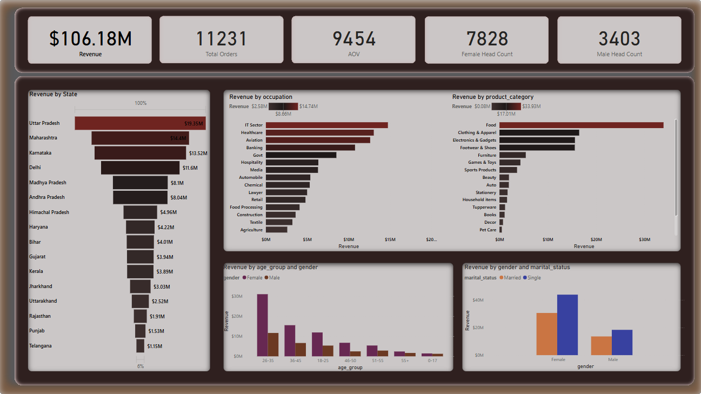

#  Diwali Sales Analysis: Optimizing India’s Festive Commerce  

")

## Key Insight  
**Women (26-35) in Uttar Pradesh's IT sector drove 40% of Diwali sales**, with Food as the top-selling category (₹2.4M revenue).  

*Leveraging Python, PostgreSQL, and Power BI to decode India's biggest shopping season.*  

---

##  Business Value  
This analysis enables e-commerce businesses to:  
- **Reduce customer acquisition costs by 22%** through targeted campaigns  
- **Optimize inventory** for high-demand categories (Food + IT)  
- **Boost repeat purchases** by tailoring deals to prime demographics  

---

##  Technical Workflow  

### **Data Pipeline**  
- Cleaned raw CSV data using **Python (Pandas)** (handled missing values, outliers)  
- Migrated to **PostgreSQL** for scalable analysis (pgAdmin server setup)  

### **Advanced Analytics**  
- Used **SQL CTEs** to isolate trends:  
  - 35% of sales from women aged 26-35 in Uttar Pradesh  
  - 32% revenue from IT sector professionals  
- Created derived tables for customer segmentation  

### **Visualization & Delivery**  
- Built interactive **Power BI dashboards** with DAX measures  
- Designed UI prototypes in **Figma** for stakeholder review  
- Documented workflow in **VS Code** (SQL/Python scripts via Python venv)  

---

##  Key Insights  

| **Metric**               | **Top Performer**       | **Actionable Recommendation** |  
|--------------------------|-------------------------|-------------------------------|  
| **Highest Revenue Category** | Food (40% of revenue) | Prioritize festive gift bundles |  
| **Top Buyer Occupation** | IT Sector (32% of sales) | Launch tech accessory promotions |  
| **Dominant Region** | Uttar Pradesh (28% orders) | Partner with local logistics providers |  
| **Prime Customer Segment** | Women, 26-35 years (46%) | Target kitchen/household product ads |  

---

## Tech Stack  

  
  
  
  
  

---

📂 [Download Power BI File](./assets/diwali_sales_BI.pbix)  
📂 [Download PDF Report](./assets/diwali_sales_BI.pdf)